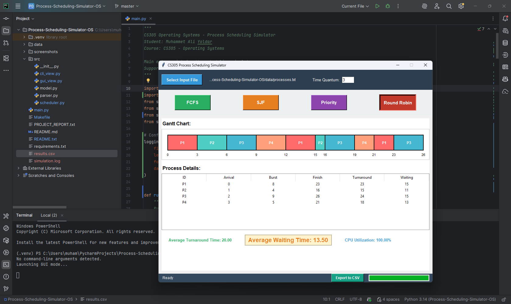
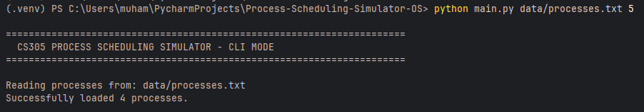
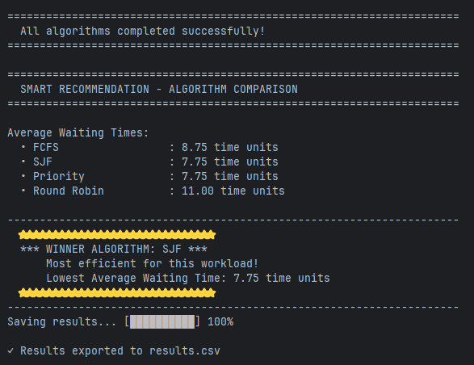
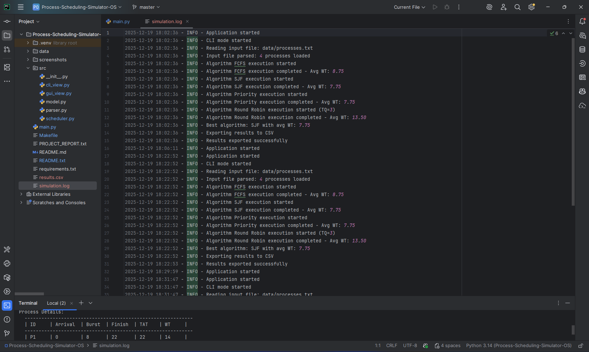

# CS305 Process Scheduling Simulator 🚀


A **hybrid (CLI + GUI) process scheduling simulator** that compares **FCFS, SJF, Priority, and Round Robin** algorithms with intelligent performance analysis and automated reporting. Built with pure Python standard library for maximum portability.

---

## ✨ Key Features

- 🎨 **Interactive GUI** with dynamic Gantt charts and real-time visualization
- 🧠 **Smart Recommendation Engine** - Auto-detects the most efficient algorithm
- 📊 **Auto-Export to CSV** - Timestamped results with append mode for historical tracking
- ⚡ **Configurable Time Quantum** via command-line arguments
- 🛠 **Comprehensive Logging System** - Full traceability with `simulation.log`
- 🎯 **Active State Tracking** - Visual feedback for algorithm selection
- 📈 **Performance Metrics** - Average Waiting Time, Turnaround Time, CPU Utilization

---

## 🚀 Installation

```bash
# Clone the repository
git clone https://github.com/muhammetaliyoldar/Process-Scheduling-Simulator-OS.git

# Navigate to project directory
cd Process-Scheduling-Simulator-OS

# No external dependencies! Pure Python Standard Library
python main.py
```

---

## 💻 Usage & Visualization

### A) Graphical User Interface (The Dashboard)

Run `python main.py` for the interactive mode. Features **active state tracking**, **progress animations**, and **real-time visualization** with color-coded Gantt charts.



The GUI offers:
- File browser for easy input selection
- One-click algorithm execution with visual feedback
- Dynamic Gantt chart rendering
- Detailed process metrics in tabular format
- Export functionality with progress indication

---

### B) CLI Mode - Execution

Run via terminal with arguments for batch processing. Example of starting the simulator:

```bash
python main.py data/processes.txt 5
```



The CLI mode automatically executes all four algorithms sequentially and generates comprehensive reports.

---

### C) Algorithm Results (Gallery)

Detailed metrics and ASCII Gantt charts for each scheduling algorithm:

#### FCFS (First Come First Served)


#### SJF (Shortest Job First)


#### Priority Scheduling


#### Round Robin (Time Quantum = 5)
.png)

*Note: The Time Quantum value (5) was passed as the second command-line argument.*

---

### D) Smart Analysis & Winner Detection

The system **compares all algorithms** and recommends the most efficient one based on Average Waiting Time with visual star highlighting.



The recommendation engine analyzes:
- Average Waiting Time (primary metric)
- Average Turnaround Time
- CPU Utilization
- Algorithmic complexity trade-offs

---

## 🔧 Engineering & Data Insights

### System Logging

Robust background logging for **debugging and traceability**. Every operation is timestamped and recorded:



Logged events include:
- Application lifecycle (startup, mode selection)
- File parsing operations
- Algorithm execution phases
- Performance metrics
- Export operations
- Error handling

---

### Data Persistence (CSV)

Results are **automatically appended** to `results.csv` for further processing, analysis, and visualization in external tools.


CSV Format:
```csv
Timestamp,Algorithm,Process_ID,Arrival,Burst,Priority,Finish,Turnaround,Waiting
2025-12-19 18:22:53,FCFS,P1,0,8,3,8,8,0
```

Features:
- **Append mode** - Historical data preservation
- **Timestamp tracking** - Run-time metadata
- **Priority inclusion** - Complete process information
- **UTF-8 encoding** - Universal compatibility

---

## 📁 Input File Format

Input files should be plain text (CSV format) with the following structure:

```
Process_ID,Arrival_Time,Burst_Time,Priority
```

**Example:**
```
P1,0,8,3
P2,1,4,1
P3,2,9,4
P4,3,5,2
```

- Lines starting with `#` are treated as comments
- Lower priority number = Higher priority
- All times are in arbitrary time units

---

## 🎯 Project Structure

```
CS305_Scheduler/
├── main.py                 # Entry point (mode selector)
├── simulation.log          # Auto-generated execution log
├── results.csv             # Exported metrics (append mode)
├── data/                   # Test input files
│   ├── processes.txt       # Standard dataset
│   ├── starvation.txt      # Priority starvation demonstration
│   └── rr_heavy.txt        # Round Robin stress test
├── src/                    # Core modules
│   ├── model.py            # Process data structures
│   ├── parser.py           # File I/O operations
│   ├── scheduler.py        # Algorithm implementations
│   ├── cli_view.py         # Terminal output & CSV export
│   └── gui_view.py         # Tkinter GUI
└── screenshots/            # Visual documentation
```

---

## 📊 Supported Algorithms

| Algorithm | Type | Complexity | Best For |
|-----------|------|------------|----------|
| **FCFS** | Non-preemptive | O(n) | Simple workloads |
| **SJF** | Non-preemptive | O(n²) | Minimizing avg waiting time |
| **Priority** | Non-preemptive | O(n²) | Critical process handling |
| **Round Robin** | Preemptive | O(n) | Time-shared systems |

---

## 🧪 Testing

Multiple test datasets included:

```bash
# Standard test case
python main.py data/processes.txt

# Demonstrate priority starvation
python main.py data/starvation.txt

# Test Round Robin with custom Time Quantum
python main.py data/rr_heavy.txt 4
```

---

## 🎓 Technical Highlights

- **Zero External Dependencies** - Pure Python Standard Library
- **Modular Architecture** - Clean separation of concerns
- **Dual Interface** - CLI for automation, GUI for visualization
- **Smart Analytics** - Automated performance comparison
- **Production Logging** - Industry-standard logging practices
- **Data Persistence** - Append-mode CSV for historical analysis
- **UI/UX Polish** - Progress bars, active states, visual feedback

---

## 📝 License & Academic Use

This project was developed for **CS305 - Operating Systems** course. Feel free to use for educational purposes with proper attribution.

---

## 👨‍💻 Author

**Muhammet Ali Yoldar**  
Student ID: 200444035  
Türk Hava Kurumu University  
Course: CS305 - Operating Systems

---

## 🙏 Acknowledgments

Special thanks to the CS305 course instructor for providing the assignment specifications and test cases.

---

*Built with ❤️ using Python and Tkinter*
