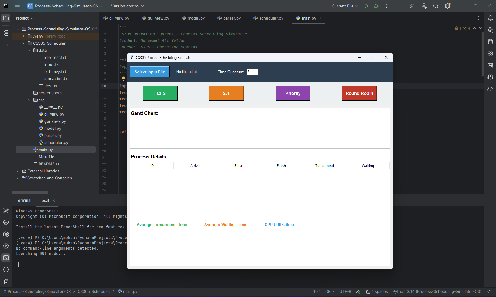
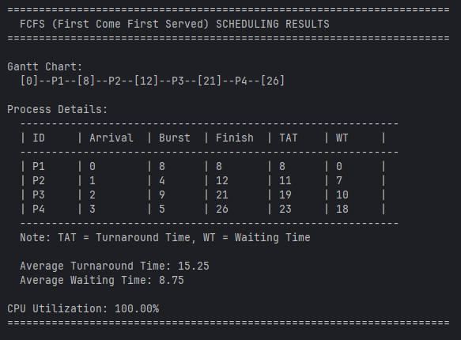
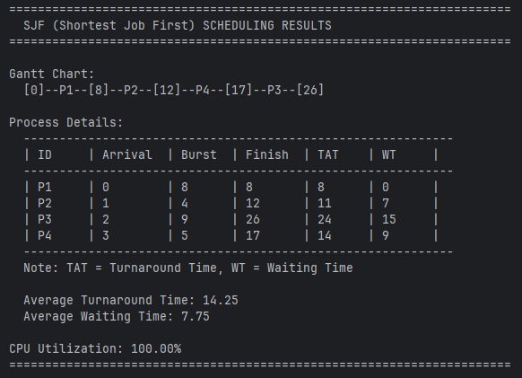
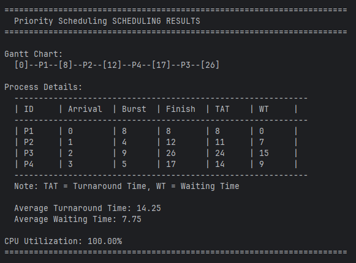

# CS305 Process Scheduling Simulator 🚀


A comprehensive CPU process scheduling simulator implementing four classic scheduling algorithms with both **Command-Line Interface (CLI)** and **Graphical User Interface (GUI)** support.

## 📋 Overview

This simulator demonstrates the behavior of four fundamental CPU scheduling algorithms:

- **FCFS** (First Come First Served) - Non-preemptive
- **SJF** (Shortest Job First) - Non-preemptive
- **Priority Scheduling** - Non-preemptive
- **Round Robin** - Preemptive with configurable time quantum

The project features a hybrid architecture supporting both terminal-based execution for batch processing and an interactive GUI for visual analysis of scheduling behavior, Gantt charts, and performance metrics.

## ✨ Features

✅ **Hybrid Architecture** - Run in CLI or GUI mode  
✅ **Gantt Chart Visualization** - Color-coded timeline with process execution  
✅ **Auto-calculation** - Waiting time, turnaround time, and CPU utilization  
✅ **Idle Time Handling** - Properly manages CPU idle periods  
✅ **Multiple Test Cases** - Includes starvation, tie-breaking, and stress tests  
✅ **Clean Code** - Well-documented, student-friendly implementation  

## 🛠️ Installation

```bash
git clone https://github.com/muhammetaliyoldar/Process-Scheduling-Simulator-OS.git

```

**Requirements:** Python 3.10+ (no external dependencies required)

## 🖥️ Usage - GUI Mode

Launch the graphical interface for interactive scheduling:

```bash
python main.py
```

### GUI Main Screen


### GUI Results


**Features:**
- Browse and select input files
- Configure time quantum for Round Robin
- Run any algorithm with a single click
- View color-coded Gantt charts
- Analyze detailed process metrics in table format

## 💻 Usage - CLI Mode

Run all four algorithms from the command line:

```bash
python main.py data/input.txt
```

Alternatively, use the Makefile:

```bash
make run
```

### CLI General Output


The CLI mode automatically executes all four scheduling algorithms sequentially and displays:
- Gantt chart timeline
- Process details table (Arrival, Burst, Finish, Turnaround, Waiting times)
- Average turnaround and waiting times
- CPU utilization percentage

## 📊 Algorithm Comparisons

### SJF (Shortest Job First)


### Priority Scheduling


### Round Robin


## 📁 Project Structure

```
CS305_Scheduler/
│
├── data/
│   ├── input.txt          # Instructor's example dataset
│   ├── starvation.txt     # Priority starvation demonstration
│   ├── idle_test.txt      # CPU idle time testing
│   ├── ties.txt           # Tie-breaking scenarios
│   └── rr_heavy.txt       # Round Robin stress test
│
├── src/
│   ├── __init__.py
│   ├── model.py           # Process class and data structures
│   ├── parser.py          # File I/O operations
│   ├── scheduler.py       # Core scheduling algorithms
│   ├── cli_view.py        # Terminal output formatting
│   └── gui_view.py        # Tkinter GUI implementation
│
├── screenshots/           # Visual documentation
├── main.py               # Application entry point
├── README.md             # This file
├── requirements.txt      # Dependencies (none required)
└── Makefile             # Quick command shortcuts
```

## 🧪 Test Files

The project includes 5 carefully designed test scenarios:

1. **input.txt** - Standard test case from assignment specifications
2. **starvation.txt** - Demonstrates priority scheduling starvation
3. **idle_test.txt** - Tests CPU idle period handling
4. **ties.txt** - Tests tie-breaking rules in FCFS and SJF
5. **rr_heavy.txt** - Stress tests Round Robin with varying burst times

## 🎯 Algorithms Explained

### FCFS (First Come First Served)
Processes are executed in the order they arrive. Simple but can suffer from the convoy effect.

### SJF (Shortest Job First)
Selects the process with the shortest burst time among arrived processes. Minimizes average waiting time but can cause starvation.

### Priority Scheduling
Executes processes based on priority levels (lower number = higher priority). Can lead to starvation of low-priority processes.

### Round Robin
Each process gets a fixed time slice (quantum). Fair scheduling that prevents starvation but may have higher context-switching overhead.

## 🚀 Quick Start Commands

```bash
# Run GUI mode
make gui

# Run CLI mode with default dataset
make run

# Clean up cache files
make clean
```

## 📝 Input File Format

```
# Comments start with #
Process_ID,Arrival_Time,Burst_Time,Priority
P1,0,8,3
P2,1,4,1
P3,2,9,4
```

## 👨‍💻 Author

**Muhammet Ali Yoldar** - 200444035  
Türk Hava Kurumu University  
CS305 - Operating Systems  

## 📄 License

This project is licensed under the MIT License - feel free to use it for educational purposes.

---

*Built with ❤️ using Python Standard Library*
